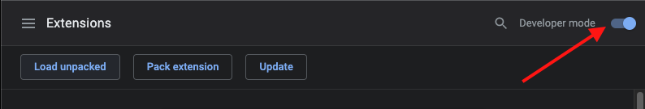
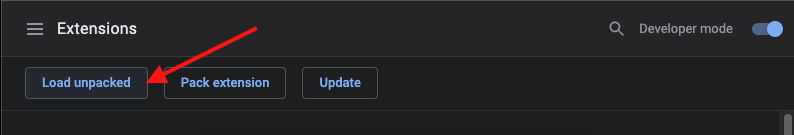
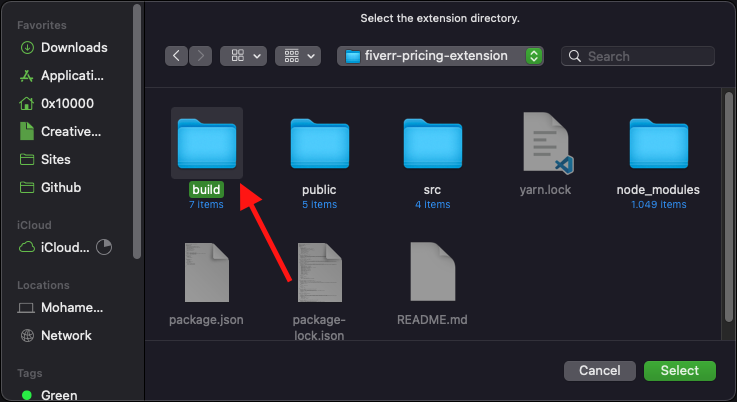
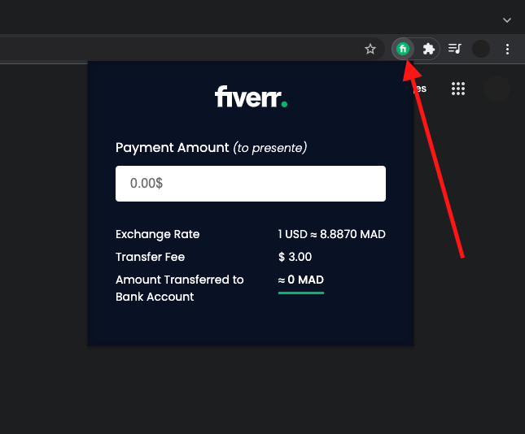

# Getting Started with Fiverr pricing extension

### `yarn build`

Builds the app for production to the `build` folder.\
It correctly bundles React in production mode and optimizes the build for the best performance.

The build is minified and the filenames include the hashes.\
Your app is ready to be deployed!

See the section about [deployment](https://facebook.github.io/create-react-app/docs/deployment) for more information.

### Upload to
Next, we will need to tell Chrome where to find our new extension. You can type this in a new Chrome Tab for opening the extensions menu:
`chrome://extensions/`

You will need to select a project’s /build folder:

let’s take a look at what we had be implemented

### `yarn build` fails to minify

This section has moved here: [https://facebook.github.io/create-react-app/docs/troubleshooting#npm-run-build-fails-to-minify](https://facebook.github.io/create-react-app/docs/troubleshooting#npm-run-build-fails-to-minify)
